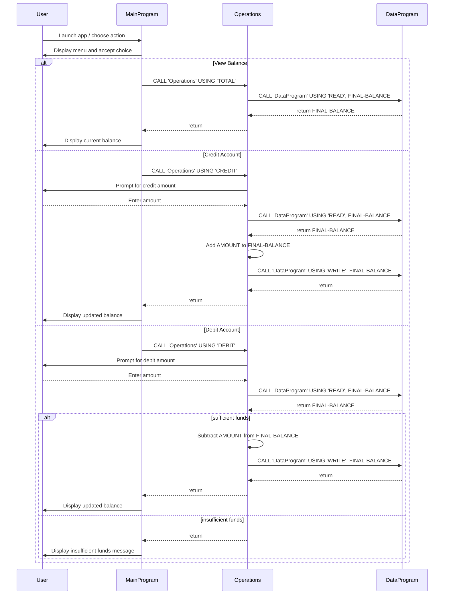

# COBOL Program Documentation

This repository contains a simple COBOL account management example. The source is split into three COBOL programs: `main.cob`, `operations.cob`, and `data.cob`.

## Files and Purpose

### `src/cobol/main.cob`
- Entry point for the program.
- Displays a menu for account operations.
- Accepts a user choice for viewing balance, crediting, debiting, or exiting.
- Calls the `Operations` program with the selected action.

### `src/cobol/operations.cob`
- Handles the business logic for account operations.
- Interprets the requested operation type: `TOTAL`, `CREDIT`, or `DEBIT`.
- For `TOTAL`:
  - Calls `DataProgram` to read the current balance.
  - Displays the current balance.
- For `CREDIT`:
  - Prompts for a credit amount.
  - Reads the current balance, adds the credit amount, then writes the new balance.
  - Displays the updated balance.
- For `DEBIT`:
  - Prompts for a debit amount.
  - Reads the current balance.
  - Only debits if funds are sufficient; otherwise displays an insufficient funds message.

### `src/cobol/data.cob`
- Stores and updates the account balance in a local working-storage field.
- Provides two operations via `PASSED-OPERATION`:
  - `READ`: returns the current stored balance.
  - `WRITE`: updates the stored balance with a new value.
- Acts as the data access layer for the simple account system.

## Key Functions

- `CALL 'Operations' USING 'TOTAL'` from `main.cob` to view the current balance.
- `CALL 'Operations' USING 'CREDIT'` from `main.cob` to credit an account.
- `CALL 'Operations' USING 'DEBIT'` from `main.cob` to debit an account.
- `CALL 'DataProgram' USING 'READ', FINAL-BALANCE` to retrieve the balance.
- `CALL 'DataProgram' USING 'WRITE', FINAL-BALANCE` to persist a modified balance.

## Business Rules for Student Accounts

Although the sample program is a general account management system, it uses a fixed account balance and can be interpreted as handling a student account balance.

Key business rules:
- The account starts with an initial balance of `1000.00`.
- Credit operations always add the entered amount to the current balance.
- Debit operations are only allowed if the current balance is greater than or equal to the debit amount.
- If a debit would overdraw the account, the program displays `Insufficient funds for this debit.` and does not change the balance.
- The program supports repeated transactions until the user chooses to exit.

## Notes

- There is no persistent storage outside the running program; balance state is only maintained in memory while the program runs.
- The currently implemented data layer is a simple COBOL program (`DataProgram`) that simulates read/write operations on in-memory state.

## Sequence Diagram

